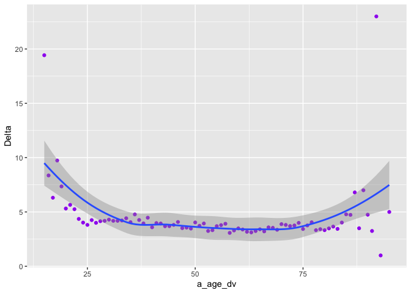

Statistical assignment 3
================
Thea Smith 670011286
12/02/20

In this assignment we will explore political interest (*vote6*) and how
it changes over time.

## Read data

First we want to read and join the data for the first 7 waves of the
Understanding Society. (Wave 8 does not have a variable for political
interest). We only want five variables: personal identifier, sample
origin, sex, age and political interest. It is tedious to join all the
seven waves manually, and it makes sense to use a loop in this case.
Since you don’t yet know about iteration I’ll provide the code for you;
please see the explanation of the code here:
<http://abessudnov.net/dataanalysis3/iteration.html>.

The only thing you need to do for this code to work on your computer is
to provide a path to the directory where the data are stored on your
computer.

``` r
library(tidyverse)
```

    ## Warning: package 'tidyverse' was built under R version 3.5.2

    ## Warning: package 'ggplot2' was built under R version 3.5.2

    ## Warning: package 'tibble' was built under R version 3.5.2

    ## Warning: package 'tidyr' was built under R version 3.5.2

    ## Warning: package 'purrr' was built under R version 3.5.2

    ## Warning: package 'dplyr' was built under R version 3.5.2

    ## Warning: package 'stringr' was built under R version 3.5.2

    ## Warning: package 'forcats' was built under R version 3.5.2

``` r
library(data.table)
```

    ## Warning: package 'data.table' was built under R version 3.5.2

``` r
# data.table is faster compared to readr so we'll use it in this case (the function fread()). You need to install this package first to be able to run this code.

# create a vector with the file names and paths
getwd()
```

    ## [1] "/Users/TheaSmith/Desktop/Data Analysis III/assignment-3-tkcs201"

``` r
files <- dir(
             # Select the folder where the files are stored.
             "/Users/TheaSmith/Desktop/Data Analysis III/assignment-3-tkcs201",
             # Tell R which pattern you want present in the files it will display.
             pattern = "indresp",
             # We want this process to repeat through the entire folder.
             recursive = TRUE,
             # And finally want R to show us the entire file path, rather than just
             # the names of the individual files.
             full.names = TRUE)

# Select only files from the UKHLS.
files <- files[stringr::str_detect(files, "ukhls")]
files
```

    ## [1] "/Users/TheaSmith/Desktop/Data Analysis III/assignment-3-tkcs201/UKDA-6614-tab/tab/ukhls_w1/a_indresp.tab"
    ## [2] "/Users/TheaSmith/Desktop/Data Analysis III/assignment-3-tkcs201/UKDA-6614-tab/tab/ukhls_w2/b_indresp.tab"
    ## [3] "/Users/TheaSmith/Desktop/Data Analysis III/assignment-3-tkcs201/UKDA-6614-tab/tab/ukhls_w3/c_indresp.tab"
    ## [4] "/Users/TheaSmith/Desktop/Data Analysis III/assignment-3-tkcs201/UKDA-6614-tab/tab/ukhls_w4/d_indresp.tab"
    ## [5] "/Users/TheaSmith/Desktop/Data Analysis III/assignment-3-tkcs201/UKDA-6614-tab/tab/ukhls_w5/e_indresp.tab"
    ## [6] "/Users/TheaSmith/Desktop/Data Analysis III/assignment-3-tkcs201/UKDA-6614-tab/tab/ukhls_w6/f_indresp.tab"
    ## [7] "/Users/TheaSmith/Desktop/Data Analysis III/assignment-3-tkcs201/UKDA-6614-tab/tab/ukhls_w7/g_indresp.tab"
    ## [8] "/Users/TheaSmith/Desktop/Data Analysis III/assignment-3-tkcs201/UKDA-6614-tab/tab/ukhls_w8/h_indresp.tab"
    ## [9] "/Users/TheaSmith/Desktop/Data Analysis III/assignment-3-tkcs201/UKDA-6614-tab/tab/ukhls_w9/i_indresp.tab"

``` r
# create a vector of variable names
vars <- c("memorig", "sex_dv", "age_dv", "vote6")

for (i in 1:7) {
        # Create a vector of the variables with the correct prefix.
        varsToSelect <- paste(letters[i], vars, sep = "_")
        # Add pidp to this vector (no prefix for pidp)
        varsToSelect <- c("pidp", varsToSelect)
        # Now read the data. 
        data <- fread(files[i], select = varsToSelect)
        if (i == 1) {
                all7 <- data  
        }
        else {
                all7 <- full_join(all7, data, by = "pidp")
        }
        # Now we can remove data to free up the memory.
        rm(data)
} 
```

## Reshape data (20 points)

Now we have got the data from all 7 waves in the same data frame
**all7** in the wide format. Note that the panel is unbalanced, i.e. we
included all people who participated in at least one wave of the survey.
Reshape the data to the long format. The resulting data frame should
have six columns for six variables.

``` r
Long <- all7 %>%
  pivot_longer(a_memorig:g_vote6, names_to = "variable", values_to = "value") %>%
  separate(variable, into = c("wave", "variable"), sep = "_", extra = "merge") %>%
  pivot_wider(names_from = variable, values_from = value)
```

## Filter and recode (20 points)

Now we want to filter the data keeping only respondents from the
original UKHLS sample for Great Britain (memorig == 1). We also want to
clean the variables for sex (recoding it to “male” or “female”) and
political interest (keeping the values from 1 to 4 and coding all
negative values as missing). Tabulate *sex* and *vote6* to make sure
your recodings were correct.

``` r
Long <- Long %>%
        filter(memorig == 1) %>%
  mutate(sex_dv = ifelse(sex_dv == 2, "female",
                         ifelse(sex_dv == 1, "male", NA))) %>%
        mutate(vote6 = recode(vote6, 
                              '1'=1, 
                              '2'=2,
                              '3'=3, 
                              '4'=4, 
                              '-1'= NA_real_, 
                              '-2'= NA_real_, 
                              '-7'= NA_real_, 
                              '-9'= NA_real_,
                              '-10'= NA_real_
        ))

table(Long$sex_dv)
```

    ## 
    ## female   male 
    ## 117665 100342

``` r
table(Long$vote6)
```

    ## 
    ##     1     2     3     4 
    ## 21660 70952 56134 52145

## Calculate mean political interest by sex and wave (10 points)

Political interest is an ordinal variable, but we will treat it as
interval and calculate mean political interest for men and women in each
wave.

``` r
meanVote6 <- Long %>%
        group_by(wave, sex_dv)%>%
  summarise(meanVote6 = mean(vote6, na.rm = TRUE))
        
meanVote6
```

    ## # A tibble: 20 x 3
    ## # Groups:   wave [7]
    ##    wave  sex_dv meanVote6
    ##    <chr> <chr>      <dbl>
    ##  1 a     female      2.84
    ##  2 a     male        2.53
    ##  3 a     <NA>        4   
    ##  4 b     female      2.82
    ##  5 b     male        2.51
    ##  6 b     <NA>        4   
    ##  7 c     female      2.87
    ##  8 c     male        2.54
    ##  9 c     <NA>        4   
    ## 10 d     female      2.89
    ## 11 d     male        2.55
    ## 12 d     <NA>        4   
    ## 13 e     female      2.87
    ## 14 e     male        2.51
    ## 15 e     <NA>        3   
    ## 16 f     female      2.81
    ## 17 f     male        2.47
    ## 18 f     <NA>        4   
    ## 19 g     female      2.73
    ## 20 g     male        2.42

## Reshape the data frame with summary statistics (20 points)

Your resulting data frame with the means is in the long format. Reshape
it to the wide format. It should look like this:

| sex\_dv | a | b | c | d | e | f | g |
| ------- | - | - | - | - | - | - | - |
| female  |   |   |   |   |   |   |   |
| male    |   |   |   |   |   |   |   |

In the cells of this table you should have mean political interest by
sex and wave.

Write a short interpretation of your findings.

``` r
meanVote6 %>%
pivot_wider(names_from = wave, values_from = meanVote6)
```

    ## # A tibble: 3 x 8
    ##   sex_dv     a     b     c     d     e     f     g
    ##   <chr>  <dbl> <dbl> <dbl> <dbl> <dbl> <dbl> <dbl>
    ## 1 female  2.84  2.82  2.87  2.89  2.87  2.81  2.73
    ## 2 male    2.53  2.51  2.54  2.55  2.51  2.47  2.42
    ## 3 <NA>    4     4     4     4     3     4    NA

From these results we can see that both men and women become more
interested in politics overall over time, from wave a to wave g. Both
men and women on average become more interested in politics from wave a
to b then increase interest between b and d, then finally increase
interest to wave g. Men on average are more interested in politics than
women. In all waves both men and women on average fall between “fairly
interested” and “not interested at all”.

## Estimate stability of political interest (30 points)

Political scientists have been arguing how stable the level of political
interest is over the life course. Imagine someone who is not interested
in politics at all so that their value of *vote6* is always 4. Their
level of political interest is very stable over time, as stable as the
level of political interest of someone who is always very interested in
politics (*vote6* = 1). On the other hand, imagine someone who changes
their value of *votes6* from 1 to 4 and back every other wave. Their
level of political interest is very unstable.

Let us introduce a measure of stability of political interest that is
going to be equal to the sum of the absolute values of changes in
political interest from wave to wave. Let us call this measure Delta. It
is difficult for me to typeset a mathematical formula in Markdown, but
I’ll explain this informally.

Imagine a person with the level of political interest that is constant
over time: {1, 1, 1, 1, 1, 1, 1}. For this person, Delta is zero.

Now imagine a person who changes once from “very interested in politics”
to “fairly interested in politics”: {1, 1, 1, 1, 2, 2, 2}. For them,
Delta = (1 - 1) + (1 - 1) + (1 - 1) + (2 - 1) + (2 - 2) + (2 - 2) = 1.

Now imagine someone who changes from “very interested in politics” to
“not at all interested” every other wave: {1, 4, 1, 4, 1, 4, 1}. Delta
= (4 - 1) + abs(1 - 4) + (4 - 1) + abs(1 - 4) + (4 - 1) + abs(1 - 4) = 3
\* 6 = 18.

Large Delta indicates unstable political interest. Delta = 0 indicates a
constant level of political interest.

Write the R code that does the following.

1.  To simplify interpretation, keep only the respondents with
    non-missing values for political interest in all seven waves.

<!-- end list -->

``` r
DeltaNoNA <- all7 %>%
  filter(complete.cases(a_vote6,b_vote6,c_vote6,d_vote6,e_vote6,f_vote6,g_vote6))    
```

2.  Calculate Delta for each person in the data set.

<!-- end list -->

``` r
DeltaNoNA <- DeltaNoNA %>%
  mutate(Delta = abs(b_vote6 - a_vote6) + 
           abs(c_vote6 - b_vote6) +
           abs(d_vote6 - c_vote6) + 
           abs(e_vote6 - d_vote6) + 
           abs(f_vote6 - e_vote6) + 
           abs(g_vote6 - f_vote6))
```

3.  Calculate mean Delta for men and women.

<!-- end list -->

``` r
MeanDeltaSex <- DeltaNoNA %>%
  group_by(a_sex_dv) %>%
  summarise(MeanDelta = mean(Delta, na.rm = TRUE))

MeanDeltaSex
```

    ## # A tibble: 2 x 2
    ##   a_sex_dv MeanDelta
    ##      <int>     <dbl>
    ## 1        1      4.42
    ## 2        2      3.62

4.  Calculate mean Delta by age (at wave 1) and plot the local
    polynomial curve showing the association between age at wave 1 and
    mean Delta. You can use either **ggplot2** or the *scatter.smooth()*
    function from base R.

<!-- end list -->

``` r
MeanDeltaAge <- DeltaNoNA %>%
  group_by(a_age_dv) %>%
  summarise(MeanDelta = mean(Delta, na.rm = TRUE))

MeanDeltaAge
```

    ## # A tibble: 80 x 2
    ##    a_age_dv MeanDelta
    ##       <int>     <dbl>
    ##  1       15     19.4 
    ##  2       16      8.36
    ##  3       17      6.31
    ##  4       18      9.73
    ##  5       19      7.35
    ##  6       20      5.32
    ##  7       21      5.65
    ##  8       22      5.26
    ##  9       23      4.36
    ## 10       24      4.02
    ## # … with 70 more rows

``` r
MeanDeltaAge %>%
  group_by(a_age_dv) %>%
  summarise(Delta = mean(MeanDelta, na.rm = TRUE)) %>%
  ggplot(aes(x = a_age_dv, y = Delta, group = 1)) +
  geom_point(col = "purple") +
  stat_smooth(method = 'loess', formula = y~x)
```

<!-- -->

5.  Write a short interpretation of your findings.

From this graph we can see that age influences the consistency of
political interest. We can see that up to about the age of 25, on
average people become more consistent from having Deltas of 9.73 at age
18 down to a Delta of 3.81 at 25. Between the ages of 26 and about 80
the Deltas decrease and after that the Deltas fluctuate. There are also
2 anomalies at age 15 with a Delta of 19.43 and at age 23 with a Delta
of 23.
